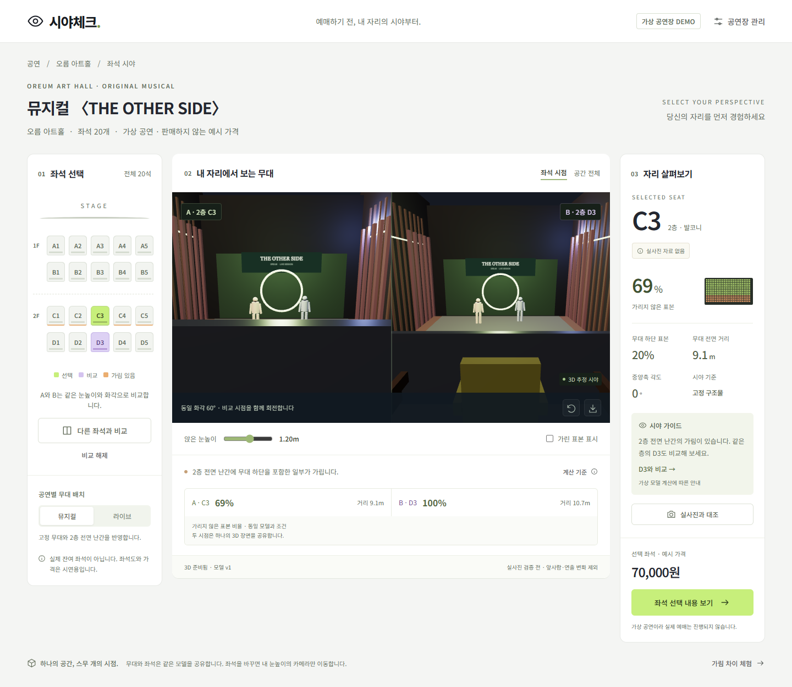

# 시야체크 · 작동하는 3D 좌석 시야 MVP

좌석을 선택하면 같은 공연장 모델에서 카메라만 이동합니다. Three.js 기반 예약 전 비교 화면과 운영자의 도면 OCR·치수 보정 화면을 구현했습니다. 실제 공연장·공연·가격·예매 재고는 없는 **가상 시제품**입니다.



기획안·기술 설계·UX 자료는 [docs/README.md](docs/README.md)에 모았습니다.
## 바로 실행

Node.js 20.19+ 또는 22.12+를 설치한 후:

```sh
git clone https://github.com/PhrenO0/sightcheck-ai.git
cd sightcheck-ai
npm install
npm run build
node scripts/serve.mjs
```

브라우저에서 **http://127.0.0.1:4173/**를 엽니다. 이 주소는 서버를 실행한 PC에서만 접근할 수 있으며 배포된 웹사이트 주소가 아닙니다. 저장소가 비공개이면 clone에도 GitHub 인증이 필요합니다.

Windows에서는 `npm run build` 후 이 폴더의 `실행.ps1`을 PowerShell로 실행하면 빌드된 앱을 로컬에서 엽니다. Node.js가 필요합니다. Codex에 포함된 Node도 자동으로 찾습니다. 실행 파일과 서버는 이 PC 안에서만 동작합니다.

```powershell
powershell -NoProfile -ExecutionPolicy Bypass -File .\실행.ps1
```

다른 환경에서 이미 빌드된 파일 실행: `node scripts/serve.mjs`. 포트 변경: PowerShell에서 `$env:SIGHTCHECK_PORT='4180'` 설정 후 실행합니다. HTML을 파일로 직접 열면 모듈·OCR worker가 동작하지 않으므로 HTTP 서버를 사용하세요.

코드를 수정할 때:

```sh
npm install
npm run prepare:ocr
npm run dev
npm test
npm run build
```

pnpm도 지원합니다. 개발 빌드는 Vite 8이 지원하는 Node 20.19+ 또는 22.12+를 사용하세요. `public/ocr`의 worker·WASM·영문 모델은 `prepare:ocr` 또는 `build`가 설치된 패키지에서 복사합니다. 인식할 때 사진을 외부 AI 서버에 전송하지 않습니다. 글꼴은 온라인에서 Noto Sans KR을 요청하며, 오프라인에서는 시스템 글꼴을 사용합니다.

## 3분 시연 순서

1. **가림 차이 체험**을 누릅니다. C3와 D3를 같은 60° 화각과 눈높이로 비교합니다. 기본 치수에서 가리지 않은 표본은 69%와 100%, C3의 무대 하단 표본은 20%입니다. 이는 가상 영역의 표본 계산이며 실제 좌석 평점이나 무대 면적 비율이 아닙니다.
2. **공간 전체**로 바꿔 20석·단차·전면 난간의 위치를 살펴봅니다. **좌석 시점**으로 돌아가 드래그·방향키로 둘러보고 눈높이와 가린 표본 표시를 조절합니다.
3. **A2**를 고른 뒤 **라이브**로 바꿉니다. 촬영 타워가 추가되면서 기본 모델의 표본 비율이 100%에서 84%로 바뀝니다.
4. **공연장 관리 → 예시 도면 불러오기 → 좌석 문자 인식**을 누릅니다. 실제 로컬 OCR이 A1~D5 20개를 추출합니다. 외부 이미지에서는 누락·오인이 가능하며, 운영자가 순서와 이름을 수정합니다.
5. 난간 높이를 **1.0m → 0.4m**로 저장합니다. C3의 표본 비율이 100%로 바뀌며 새로고침 후에도 치수와 모델 버전이 유지됩니다. 기본 모델은 **가상 모델로 복원**으로 돌아옵니다.
6. **실사진과 대조**에서 이미지를 첨부하고 촬영 조건과 대조 내용을 남깁니다. 모델·좌석 이름·공연 배치·눈높이가 바뀌면 이전 기록은 재대조 상태입니다. 대조 완료 표시는 운영자 기록이며 자동 정확도 인증이 아닙니다.
7. **시야 이미지 저장**을 누르면 가상 모델 안내·좌석·버전·눈높이가 포함된 PNG를 받습니다. **좌석 선택 내용 보기**는 비교 메모를 제공합니다. 운영자가 HTTP(S) 예매 주소를 등록한 경우에만 외부 페이지로 연결합니다.

## 구현 범위

| 항목 | 구현 |
| --- | --- |
| 3D | 공유된 공연장 모델, 20석 InstancedMesh, 무대 2종, 좌석 눈높이 카메라, 키보드/드래그 회전, 전체 공간 보기 |
| 비교 | 한 WebGL 컨텍스트·한 장면을 두 카메라/viewport로 렌더링, 동일 눈높이·화각 |
| 계산 | 무대 전면의 25×13 표본, 난간·촬영 타워 Box3 교차, 하단 표본·거리·중앙축 각도 |
| 보정 | 실제 OCR(Tesseract.js 7), 도면/좌석 이름 확인, 8가지 치수·공연장 이름·예매 주소 수정 |
| 저장 | 브라우저 localStorage, 모델 JSON import/export, 입력 검증, 사진 첨부·대조·이전 조건 표시 |
| 출력 | 현재 시야 PNG, 예매 전 메모, 외부 예매 주소 연결 |
| 모바일 | 320px 이상 레이아웃, 픽셀 비율 상한 1.6, 변화가 있을 때 렌더링 |
| WebGL 미지원 | 좌석도·가림 계산 유지 및 안내. 서버 정적 이미지 대체 기능은 아직 미구현 |

모델 생성은 **4행 × 5열 규칙 배치**에 한정합니다. OCR은 영문·숫자 좌석 문자 후보만 읽습니다. 불규칙 좌석 위치, 곡선 관람석, 실제 공간의 깊이와 축척을 이미지 하나로 추정하지 않습니다. 치수는 운영자가 입력합니다. 좌석 사이 간격과 행 간격은 전체에 적용하며 하층 단차는 예시 값입니다.

Blender는 런타임 의존성이 아닙니다. 현재 좌석·벽·무대·인체 기준 자산을 코드로 제작했습니다. 현장 모델을 확장할 때 Blender로 만든 glTF 자산·베이크 텍스처를 표시층에 붙일 수 있지만, 가림 판정용 구조물과 좌표·실루엣·모델 버전을 맞춰야 합니다.

## 검증 결과 (2026-09-30)

- Node 테스트 5개 통과: 발코니 앞/뒷줄 가림, 공연별 타워 영향, 난간·눈높이 변화, 잘못된 모델/URL 거부, OCR 후보 정렬.
- 실제 예시 PNG OCR 20개 추출: `node scripts/check-ocr.mjs`. 처음 사용한 글꼴에서는 18개만 추출돼 선명한 예시로 보정했으며, 실제 도면의 인식률을 보장하지 않습니다.
- Chrome 브라우저 조작: 좌석·비교·공간 보기·무대 변경·도면 OCR·저장/새로고침 복원·누락 좌석 저장 거부·사진/메모 검증·사진 조건 변경 표시·예매 메모 확인.
- PNG 실제 생성·다운로드 확인: 별도 Chrome/Playwright 컨텍스트에서 `sightcheck-C3.png` 다운로드 성공(실패 값 없음). agent-browser의 Windows 다운로드는 일반 이미지에서도 취소되어 이 항목을 별도로 검증했습니다. 결과 파일은 `screenshots/export.png`입니다.
- 1440×1000, 390×844, 320×800 레이아웃 확인. 390px·320px에서 가로 넘침 없음.
- 자동 접근성 검사 axe 4.12.1: 390px 기본 화면 위반 0개. 캔버스 위 안내 문구의 배경 대비는 자동 검사 미확정 1개이며 사람 검토가 필요합니다.

스크린샷: `screenshots/desktop.png`, `compare.png`, `overview.png`, `mobile.png`. 이 결과는 데스크톱 Chrome 검증이며 실제 모바일 기기의 GPU·메모리·느린 네트워크 성능 실적은 아닙니다.

## 실서비스 전에 필요한 작업

실제 공연장 실측·자료 사용 허락, 대표 좌석 실사진 검증, 운영자 계정과 서버 데이터 저장, 공연별 모델 승인/배포, 티켓 플랫폼 계약 및 재고·좌석 ID 연동이 필요합니다. 앞사람·기둥·추가 세트 등 실제 가림 객체의 범위를 넓히고 현장 사진과 계산 결과의 오차를 측정해야 합니다. 서버 시야 이미지 렌더링/캐시, 360도 실사진, 사진 복원·Gaussian Splatting·LLM 상담은 이 버전의 구현 범위에 포함되지 않습니다.

AI 구현은 OCR입니다. 규칙 기반 시야 가이드를 LLM 답변으로 표시하지 않습니다. 업로드 사진에서 치수를 자동 생성하거나 실사진 인증을 주장하지 않습니다. 시제품에 계정·결제·다중 사용자 백엔드는 없습니다.

## 소스 구성과 오픈소스

- `src/model.js`: 모델 검증, 좌석 좌표, 고정 구조물, 광선 교차 계산
- `src/scene.js`: 재사용 자산, 인스턴싱, 공통 renderer, 카메라, PNG 출력
- `src/main.js`: 사용자/운영자 흐름, 사진 대조 기록과 버전 관리
- `src/ocr.js`: 실제 OCR worker와 문자 후보 정렬
- `scripts/prepare-ocr.mjs`: 로컬 worker/WASM/모델 준비
- `scripts/serve.mjs`: 빌드 앱을 로컬에서 서비스

[Three.js](https://github.com/mrdoob/three.js) MIT, [Tesseract.js](https://github.com/naptha/tesseract.js) Apache-2.0, [Tesseract.js-core](https://github.com/naptha/tesseract.js-core) Apache-2.0, [Vite](https://github.com/vitejs/vite) MIT. 영문 OCR 패키지 `@tesseract.js-data/eng`는 패키지 메타데이터상 MIT이며 [기반 언어 모델의 라이선스](https://github.com/tesseract-ocr/tessdata_best/blob/main/LICENSE)는 Apache-2.0입니다. 가중치/엔진은 온디맨드로 읽으며 초기 좌석 화면에 미리 내려받지 않습니다. 번들에 포함한 라이선스는 `public/licenses`와 빌드된 `dist/licenses`에서 확인할 수 있습니다.
