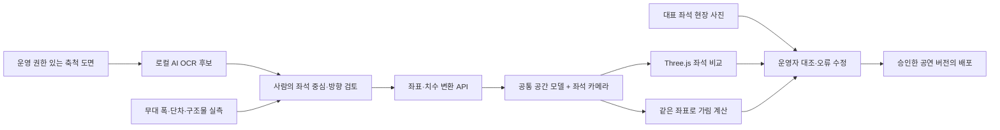

# 기술 선택과 실증 계획

2026.10.01 · 제출용 3페이지의 세부 근거

## 제품을 좁힌 이유

초기 사용자: 난간·발코니가 있는 공연장을 처음 찾는 뮤지컬 관객. 구매 고객: 해당 공연장 운영사 또는 제작사. 결정할 문제: 같은 가격대의 두 자리 중 어떤 가림을 감수할지. 기업이 구매할 이유: 반복 시야 문의와 안내 자료 갱신 시간을 줄이는지 확인.

전체 예약·재고·결제를 새로 만들면 공연·좌석 공급 계약이 먼저 필요하다. 첫 제품은 기존 예매에 붙는 좌석 시야 안내다. 자체 데모의 외부 예매 링크가 특정 좌석 예약과 연동되었다는 뜻은 아니다. 실제 연동에서는 판매처의 좌석 ID, 공연 회차, 가격/재고, 해당 회차의 모델 버전을 맞춰야 한다.

## 오픈소스 비교와 채택

| 후보 | 역할·근거 | 선택 | 상태 |
| --- | --- | --- | --- |
| [Three.js](https://threejs.org/docs/) | 웹 카메라·공통 모델·인스턴싱. MIT | 좌석 이동마다 새 이미지를 만들지 않는 표시층 | 실제 사용 |
| [Tesseract.js](https://github.com/naptha/tesseract.js) | WASM OCR. Apache-2.0 | 원본 도면을 브라우저에서 처리, 영문·숫자 좌석 문자와 bbox 후보 | 실제 사용 |
| 자체 축척 변환·광선 엔진 | 두 기준점/실측 폭, 명시적 단차, 구조물 박스 | 좌석/치수의 근거를 추적하고 표시·계산 좌표를 일치시킴 | 실제 사용 |
| [SAM 2](https://github.com/facebookresearch/sam2) | 클릭·박스 프롬프트로 이미지/영상 객체 분할, Apache-2.0 | 난간/기둥 후보 마스크 추출 보조. 마스크는 깊이나 실측 치수가 아님 | 후속 검토, 미연동 |
| [Depth Anything V2](https://github.com/DepthAnything/Depth-Anything-V2) | 상대 깊이 모델과 별도 metric depth 모델 제공 | 외관 깊이·구조물 후보 참고. 공연장 치수 정답으로 쓰지 않음 | 미연동. Small Apache-2.0, Base/Large/Giant CC-BY-NC-4.0 구분 |
| [COLMAP](https://colmap.github.io/tutorial.html) | 겹쳐 찍은 여러 시점으로 SfM→MVS 재구성 | 외관이 중요한 유료 옵션. 실측 축척 맞춤·리토폴로지·정합 필요 | 미연동 |
| [PolyLayout](https://github.com/ghanning/PolyLayout) | 알려진 카메라 자세의 투시 이미지로 여러 방의 Manhattan 구조 추정. Apache-2.0 | 평면/벽 구조 초안 후보. 곡선 객석·단차·난간·좌석 ID는 따로 입력·검수해야 함 | 연구 후보, 미연동 |
| [SuperSplat](https://github.com/playcanvas/supersplat) / [Viewer](https://developer.playcanvas.com/user-manual/supersplat/viewer/) | 만들어진 3D Gaussian splat의 브라우저 편집·최적화·웹 배포. MIT | 촬영 기반 외관 옵션. 실측 좌표 정합 및 별도 가림 계산용 구조 모델 필요 | 후보, 미연동. 사진→스플랫 생성기는 별도 필요 |
| Blender / glTF | 자산 편집과 베이크 텍스처 | 공통 자산 제작·복잡한 공연장 수작업 보정에 선택적으로 사용 | 현재 실행 의존성 아님 |
| [unreal-home-wizard](https://github.com/amirmushichge/unreal-home-wizard) | 사진으로 검토 가능한 Unreal 공간 프로젝트를 만드는 작업 흐름 | 사진 근거와 사람 검토 흐름 참고. 공연장 시야 정확도의 증거 아님 | 참고, 코드 미복사 |
| [football-stadium](https://github.com/thebuggeddev/football-stadium) | 구매 전 좌석을 3D로 보는 예시 | 좌석·카메라 UX 참고. 도면/사진 자동 변환 엔진은 별도 문제 | 참고, 코드 미복사 |

라이선스와 용도는 위 공식 저장소·문서에서 확인했다. 참고 저장소의 코드·모델·이미지를 가져올 경우 각 자산의 권한을 별도로 확인한다. 이번 구현에는 해당 두 참고 저장소의 코드/자산을 복사하지 않았다.

[COLMAP의 촬영 안내](https://colmap.github.io/tutorial.html)는 서로 겹치는 다른 시점, 비슷한 조명, 충분한 질감 등을 요구한다. 같은 자리에서 카메라만 돌리는 360 촬영은 모든 좌석의 3D 재구성 입력을 대신하지 못한다. Depth Anything의 상대 깊이와 미터 단위 실제 길이는 구분해야 하며, 별도 metric 모델도 미관측 공간과 작은 난간의 정확도를 보장하지 않는다.

## 시야를 믿을 수 있게 만드는 파이프라인

현재 구현은 변환·표시·계산·브라우저 사진 기록까지다. 승인 서버와 예매 플랫폼 위젯 배포는 후속 개발이다. 정량 오차를 계산한 자동 사진 정합/검수는 구현하지 않았다.

외관: 공통 마감·조명·좌석 자산으로 세련되게 표현한다. 판단: 측정한 좌석 위치·눈높이·무대 영역·가림 구조물로 계산한다. 예쁜 외관이 치수의 정확도를 뜻하지 않는다. 앞으로 외관 자산을 추가할 때도 실제 가림 물체와 표시 실루엣을 일치시켜야 한다. 곡선·개방형 난간은 현재 불투명 박스 근사에서 오류가 날 수 있다.

사진 기반 고급화 순서: 권한 있는 겹치는 다중 시점 촬영 → 카메라 자세·실측 축척 확보 → 사진 기반 외관 생성 → SuperSplat에서 잡음 제거·압축 → 실측 모델과 좌표 정합 → 대표 좌석에서 가림 경계 대조 → 모바일 전송량·첫 화면 시간 측정. 별도 외관 뷰를 시야 정확도를 인증한 화면으로 제시하지 않는다. PolyLayout은 직교 벽 구조의 초안 보조 후보로만 비교하며, 공연장에 바로 적합하다고 가정하지 않는다. 현재 이 경로를 구현하거나 성능을 측정한 것은 아니다.

360 이미지는 고정된 한 좌석의 회전 시야를 저렴하게 보여줄 수 있지만 좌석 이동에 따른 시차를 만들지 못한다. 전 좌석별 파노라마를 미리 생성·저장하면 좌석 수×해상도×공연 버전만큼 저장/갱신이 늘어난다. 우선 공통 경량 모델을 한 번 불러오고 좌석 카메라만 바꾸며, 저사양 환경의 대표 좌석 정지 이미지 캐시는 후속 측정으로 결정한다.

## BM과 협업 순서

초기 가격 가설: 최초 등록·검수 50만 원, 공연별 갱신 10만 원. 이는 계약·시장 평균·확정 견적이 아니다. 등록 시간, 촬영/방문 비용, 수정 횟수, 플랫폼 연동 공수를 기록한 뒤 가격을 다시 정한다. 최초 50만 원이 현장 출장과 수십 시간 작업을 포함하면 손해일 수 있다. 서류 정리만 자동화하고 현장 검수가 계속 수작업이면 반복 매출도 제한된다.

문의 절감 가치 = 감소한 시야 문의 수 × 건당 응대 시간 × 시간당 인건비. 예매 전환 가치 = 실험군과 대조군의 회차/유입/좌석 가격 조건을 맞춘 추가 구매 기여. 현장 불만 절감은 판매량과 시야 관련 문의 유형을 나눠 확인한다. 제한 시야를 공개하면 일부 좌석의 판매가 줄 수 있으므로 전환만을 성과로 삼지 않는다.

1. 자체 예매 페이지를 쓰는 소규모 공연장 1곳을 방문해 자료 제공·현장 촬영·유료 파일럿 가능성을 확인한다.
2. 공연장과 제작사 중 시야 문의를 실제로 처리하고 예산을 결정하는 주체를 찾는다. 같은 공연장의 다음 공연에서도 다시 쓸 이유를 검증한다.
3. 이후 NHN LINK 등 공연 예매 플랫폼 또는 네이버 예약 입점 운영자에게 샘플 위젯·좌석 ID 매핑·실증 리포트를 제안한다. 협업 후보이며 제휴 확정 아님.

전자상거래 수수료 사업보다 도면 입력·공연 갱신·검수 도구에서 먼저 매출을 만든다. 대형 플랫폼 계약이 없어도 한 공연장의 실제 업무에서 검증할 수 있어야 한다.

## 첫 1개월 / 3개월의 검증

| 시기 | 실행 | 남길 증거 |
| --- | --- | --- |
| 1주 | 관객 10명, 운영자 3명 인터뷰. 취소·후기 검색·시야 문의의 실제 사례를 확인 | 익명 문제 기록, 운영자의 최근 문의 분류와 현재 안내 방식 |
| 2주 | 공연장 1곳의 20개 좌석과 2개 배치 촬영/실측. 현장 담당자와 도면 입력 | 좌석·배치별 정답 사진, 누락 물체, 입력/수정/검수 작업 시간 |
| 3~4주 | 관객 20명, 기존 좌석도와 시야체크를 순서 교차 사용 | 선택 시간·추가 검색·확신·잘못 이해한 가림, 운영자 가격 수용 여부 |
| 2~3개월 | 실제 예매 페이지 한 곳에서 유료 파일럿. 개인정보를 최소화한 이벤트 수집 | 시야 열기→비교→공식 예매 이동, 실제 구매 연결 가능 범위, 문의 시간과 재사용 의향 |

표본 수는 실행 계획이며 통계적 확증을 보장하지 않는다. 현재 인터뷰·현장 촬영·유료 고객·구매 전환 데이터는 없다. 데모 사용 결과를 실제 사용자 성과로 바꾸어 적지 않는다.

## 중단·수정 기준

관객이 좌석 판단에 도움을 받지 못하거나 가림을 잘못 이해하면 설명/표시를 수정한다. 가림을 놓치는 현장 오류가 있으면 해당 좌석·배치의 안내를 먼저 보류한다. 운영자가 자료를 준비하는 데 수작업 모델링과 비슷한 시간을 쓰면 자동화 범위를 다시 잡는다. 유료 파일럿 제안을 받은 운영자들이 반복 갱신의 필요성과 비용을 받아들이지 않으면 B2B 구독을 확대하지 않는다.

수상을 위해 더 큰 범위를 주장하기보다 **한 공연장의 실제 입력 자료 → 시야 검수 → 관객 행동 → 유료 재사용**을 보여주는 것이 다음 제품 증거다. 현 단계의 약점은 검증된 고객·현장 정확도와 AI의 추가 효과가 없다는 점이다. OCR 자동 입력과 완전 수동 입력의 시간을 비교하면 AI가 어떤 비용을 줄이는지 첫 증거를 만들 수 있다.
